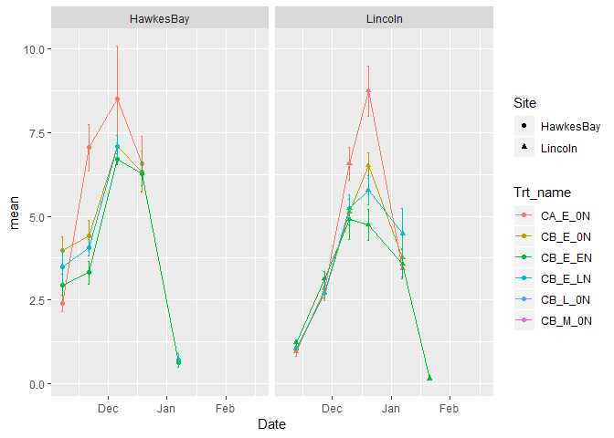

Transforming Pea data into observed data for sims discovery science
================
R Zyskowski , Adrain Hunt
2019-05-21

  - [Step one read data from Excel
    File](#step-one-read-data-from-excel-file)
      - [Data management](#data-management)
      - [Create the Raw Data files](#create-the-raw-data-files)
      - [Removing rows with NAs (missing values) in
        `data.frame`](#removing-rows-with-nas-missing-values-in-data.frame)
      - [Add column Represeint Site](#add-column-represeint-site)
      - [Merge the Two Dataframes based on Common
        factors](#merge-the-two-dataframes-based-on-common-factors)
      - [Fix up Columns to match Both](#fix-up-columns-to-match-both)
  - [have sample values - need plot values
    g/m2](#have-sample-values---need-plot-values-gm2)
      - [we have biomass so cancaluclate N
        levels](#we-have-biomass-so-cancaluclate-n-levels)

## Step one read data from Excel File

Key processes:

  - Reads *Technically correct* data into `data.frame`

  - Combines the Lincoln & Hawkes bay data

#### Data management

Load the required libraries.

``` r
# load the required libraries
library(lubridate)
```

    ## 
    ## Attaching package: 'lubridate'

    ## The following object is masked from 'package:base':
    ## 
    ##     date

``` r
library(plyr);library(dplyr)
```

    ## 
    ## Attaching package: 'plyr'

    ## The following object is masked from 'package:lubridate':
    ## 
    ##     here

    ## 
    ## Attaching package: 'dplyr'

    ## The following objects are masked from 'package:plyr':
    ## 
    ##     arrange, count, desc, failwith, id, mutate, rename, summarise,
    ##     summarize

    ## The following objects are masked from 'package:lubridate':
    ## 
    ##     intersect, setdiff, union

    ## The following objects are masked from 'package:stats':
    ## 
    ##     filter, lag

    ## The following objects are masked from 'package:base':
    ## 
    ##     intersect, setdiff, setequal, union

``` r
library(dplyr)
library(tidyr)
library(ggplot2)
library(magrittr) #required to use the pipe (%>%) operator
```

    ## 
    ## Attaching package: 'magrittr'

    ## The following object is masked from 'package:tidyr':
    ## 
    ##     extract

``` r
library(readxl)
library(tidyverse)
```

    ## -- Attaching packages --------------------------------------------------------------------------------------------------- tidyverse 1.2.1 --

    ## v tibble  1.4.2     v purrr   0.2.5
    ## v readr   1.1.1     v stringr 1.3.1
    ## v tibble  1.4.2     v forcats 0.3.0

    ## -- Conflicts ------------------------------------------------------------------------------------------------------ tidyverse_conflicts() --
    ## x dplyr::arrange()         masks plyr::arrange()
    ## x lubridate::as.difftime() masks base::as.difftime()
    ## x purrr::compact()         masks plyr::compact()
    ## x dplyr::count()           masks plyr::count()
    ## x lubridate::date()        masks base::date()
    ## x magrittr::extract()      masks tidyr::extract()
    ## x dplyr::failwith()        masks plyr::failwith()
    ## x dplyr::filter()          masks stats::filter()
    ## x plyr::here()             masks lubridate::here()
    ## x dplyr::id()              masks plyr::id()
    ## x lubridate::intersect()   masks base::intersect()
    ## x dplyr::lag()             masks stats::lag()
    ## x dplyr::mutate()          masks plyr::mutate()
    ## x dplyr::rename()          masks plyr::rename()
    ## x purrr::set_names()       masks magrittr::set_names()
    ## x lubridate::setdiff()     masks base::setdiff()
    ## x dplyr::summarise()       masks plyr::summarise()
    ## x dplyr::summarize()       masks plyr::summarize()
    ## x lubridate::union()       masks base::union()

\*\* Set the directories and Data
File\*\*

``` r
url <- "https://iplant.plantandfood.co.nz/project/P442060-13/_layouts/15/WopiFrame.aspx?sourcedoc=/project/P442060-13/Research/18_19_SAE_pea_protein_managment.xlsx&action=default"

Source_HB = "RAW_HB"
Source_Linc = "RAW_Lincoln"
```

### Create the Raw Data files

``` r
source(file = "../IplantScrape.r") #source scraper function 

df_RAW_Lincoln<- scrape_xl(url, sheet = Source_Linc, skip = 2)
df_RAW_HB<- scrape_xl(url, sheet =  Source_HB, skip = 2)


df_RAW_HB$Index  <- NULL
df_RAW_Lincoln$Index  <- NULL
#name contains &
names(df_RAW_Lincoln)[38] <- "FinalPodPeaFW"
```

#### Inspection of loaded data set

``` r
#Retrieve the classes of all columns in a data.frame 
str(df_RAW_Lincoln)
```

    ## Classes 'tbl_df', 'tbl' and 'data.frame':    160 obs. of  56 variables:
    ##  $ Date                 : POSIXct, format: "2018-11-12" "2018-11-12" ...
    ##  $ Event                : chr  "Intermed_H1" "Intermed_H1" "Intermed_H1" "Intermed_H1" ...
    ##  $ Plot                 : num  2 4 5 6 7 8 9 11 14 15 ...
    ##  $ Block                : num  1 1 1 1 2 2 2 2 3 3 ...
    ##  $ Trt_num              : num  2 3 4 1 4 3 2 1 2 4 ...
    ##  $ Trt_name             : chr  "CB_E_0N" "CB_E_EN" "CB_E_LN" "CA_E_0N" ...
    ##  $ Cultivar             : chr  "Cult B" "Cult B" "Cult B" "Cult A" ...
    ##  $ Sowing_Date          : chr  "Early" "Early" "Early" "Early" ...
    ##  $ N_timing             : chr  "0N" "Early N" "Late N" "0N" ...
    ##  $ HA                   : num  0.5 0.5 0.5 0.5 0.5 0.5 0.5 0.5 0.5 0.5 ...
    ##  $ PP                   : num  38 39 46 49 49 59 47 40 46 42 ...
    ##  $ TFW                  : num  166 151 184 147 226 ...
    ##  $ SSFW                 : num  123 108 142 114 167 ...
    ##  $ SSDW                 : num  14.5 12.6 17.2 13.3 18.6 19.8 16.6 9.2 14.7 13.7 ...
    ##  $ partFW               : num  41.3 42.3 41.8 32 46.1 ...
    ##  $ greenleafFW          : num  16.3 17.8 16 20.4 18.1 ...
    ##  $ greenstemFW          : num  25 24.8 22.9 11.6 27.6 ...
    ##  $ deadstemFW           : num  0 0 0 0 0 0 0 0 0 0 ...
    ##  $ deadleafFW           : num  0 0 0 0 0 0 0 0 0 0 ...
    ##  $ greenpodFW           : num  0 0 0 0 0 0 0 0 0 0 ...
    ##  $ maturepodFW          : num  0 0 0 0 0 0 0 0 0 0 ...
    ##  $ greengrainFW         : num  0 0 0 0 0 0 0 0 0 0 ...
    ##  $ maturegrainFW        : num  0 0 0 0 0 0 0 0 0 0 ...
    ##  $ Leaf_area            : num  612 653 613 603 710 ...
    ##  $ Stem_area            : num  138.5 137.6 131 60.7 169.8 ...
    ##  $ Pod_area             : num  0 0 0 0 0 0 0 0 0 0 ...
    ##  $ greenleafDW          : num  2.26 2.63 2.33 2.66 2.4 2.22 2.27 2.58 2.17 2.29 ...
    ##  $ greenstemDW          : num  2.85 2.85 2.64 1.25 2.97 2.67 2.61 1.18 2.43 2.4 ...
    ##  $ deadstemDW           : num  0 0 0 0 0 0 0 0 0 0 ...
    ##  $ deadleafDW           : num  0 0 0 0 0 0 0 0 0 0 ...
    ##  $ greenpodDW           : num  0 0 0 0 0 0 0 0 0 0 ...
    ##  $ maturepodDW          : num  0 0 0 0 0 0 0 0 0 0 ...
    ##  $ greengrainDW         : num  0 0 0 0 0 0 0 0 0 0 ...
    ##  $ maturegrainDW        : num  0 0 0 0 0 0 0 0 0 0 ...
    ##  $ GreenPeaNum          : num  0 0 0 0 0 0 0 0 0 0 ...
    ##  $ MaturePeaNum         : num  0 0 0 0 0 0 0 0 0 0 ...
    ##  $ Final_ResidueSubFW   : num  0 0 0 0 0 0 0 0 0 0 ...
    ##  $ FinalPodPeaFW        : num  0 0 0 0 0 0 0 0 0 0 ...
    ##  $ Final_podFW          : num  0 0 0 0 0 0 0 0 0 0 ...
    ##  $ Final_grainFW        : num  0 0 0 0 0 0 0 0 0 0 ...
    ##  $ Final_Pod_num        : num  0 0 0 0 0 0 0 0 0 0 ...
    ##  $ Final_100grainFW     : num  0 0 0 0 0 0 0 0 0 0 ...
    ##  $ Final_ResidueSubDW   : num  0 0 0 0 0 0 0 0 0 0 ...
    ##  $ Final_podDW          : num  0 0 0 0 0 0 0 0 0 0 ...
    ##  $ Final_100grainDW     : num  0 0 0 0 0 0 0 0 0 0 ...
    ##  $ Final_GrainMoisture  : num  0 0 0 0 0 0 0 0 0 0 ...
    ##  $ Final_GrainCount     : num  0 0 0 0 0 0 0 0 0 0 ...
    ##  $ N_Content_Green_Leaf : chr  "5.5339999999999998" "5.5119999999999996" "5.2569999999999997" "5.1529999999999996" ...
    ##  $ N_Content_Green_Stem : chr  "4.0570000000000004" "4.2089999999999996" "3.7789999999999999" "3.629" ...
    ##  $ N_Content_Dead_Stem  : chr  "-" "-" "-" "-" ...
    ##  $ N_Content_Dead_Leaf  : chr  "-" "-" "-" "-" ...
    ##  $ N_Content_Green_Pod  : chr  "-" "-" "-" "-" ...
    ##  $ N_Content_Mat_Pod    : chr  "-" "-" "-" "-" ...
    ##  $ N_Content_Green_Grain: chr  "-" "-" "-" "-" ...
    ##  $ N_Content_Mat_Grain  : chr  "-" "-" "-" "-" ...
    ##  $ N_Content_Residue    : chr  "-" "-" "-" "-" ...

``` r
str(df_RAW_HB)
```

    ## Classes 'tbl_df', 'tbl' and 'data.frame':    136 obs. of  59 variables:
    ##  $ Date                 : POSIXct, format: "2018-11-07" "2018-11-07" ...
    ##  $ Event                : chr  "H1" "H1" "H1" "H1" ...
    ##  $ Plot                 : num  1 2 4 6 7 8 9 10 15 16 ...
    ##  $ Block                : num  1 1 1 1 2 2 2 2 3 3 ...
    ##  $ Trt_num              : num  1 3 4 2 4 2 3 1 2 4 ...
    ##  $ Trt_name             : chr  "CA_E_0N" "CB_E_EN" "CB_E_LN" "CB_E_0N" ...
    ##  $ Cultivar             : chr  "Cult A" "Cult B" "Cult B" "Cult B" ...
    ##  $ Sowing_Date          : chr  "Early" "Early" "Early" "Early" ...
    ##  $ N_timing             : chr  "0N" "Early N" "Late N" "0N" ...
    ##  $ HA                   : num  0.5 0.5 0.5 0.5 0.5 0.5 0.5 0.5 0.5 0.5 ...
    ##  $ PP                   : num  63 56 63 40 54 54 44 46 48 30 ...
    ##  $ TFW                  : num  207 205 246 195 237 ...
    ##  $ TFW2                 : num  NA NA NA NA NA NA NA NA NA NA ...
    ##  $ SSFW                 : num  176 189 230 179 214 ...
    ##  $ SSDW                 : num  24.9 25 30.8 24.4 28.9 49 19.8 20.9 28.8 16.9 ...
    ##  $ partFW               : chr  "31" "16.100000000000001" "15" "15.9" ...
    ##  $ greenleafFW          : num  17.1 16.1 15 15.9 22.5 20.9 19.7 27.2 21.9 25.6 ...
    ##  $ greenstemFW          : num  10.9 29.1 25.9 29.7 44.1 42.7 38.2 20 39.7 40.4 ...
    ##  $ deadFW               : num  NA NA NA NA NA NA NA NA NA NA ...
    ##  $ greenpodFW           : num  NA NA NA NA NA NA NA NA NA NA ...
    ##  $ maturepodFW          : chr  NA NA NA NA ...
    ##  $ grainFW              : num  NA NA NA NA NA NA NA NA NA NA ...
    ##  $ maturegrainFW        : num  NA NA NA NA NA NA NA NA NA NA ...
    ##  $ Pea_num              : num  NA NA NA NA NA NA NA NA NA NA ...
    ##  $ Leaf_area            : num  524 628 564 552 846 ...
    ##  $ Stem_area            : num  53.4 162.8 131.2 141.9 241.4 ...
    ##  $ Pod_area             : num  NA NA NA NA NA NA NA NA NA NA ...
    ##  $ greenleafDW          : num  2.9 2.7 2.5 2.7 3.6 3.5 3.2 4.4 3.6 4.1 ...
    ##  $ greenstemDW          : num  1.5 3.9 3.3 3.8 5.5 5.5 4.8 2.5 5.1 5 ...
    ##  $ deadDW               : num  NA NA NA NA NA NA NA NA NA NA ...
    ##  $ greenpodDW           : num  NA NA NA NA NA NA NA NA NA NA ...
    ##  $ maturepodDW          : chr  NA NA NA NA ...
    ##  $ grainDW              : num  NA NA NA NA NA NA NA NA NA NA ...
    ##  $ maturegrainDW        : num  NA NA NA NA NA NA NA NA NA NA ...
    ##  $ Final_residueFW      : num  NA NA NA NA NA NA NA NA NA NA ...
    ##  $ Final_podFW          : num  NA NA NA NA NA NA NA NA NA NA ...
    ##  $ Final_grainFW        : num  NA NA NA NA NA NA NA NA NA NA ...
    ##  $ Pod_num              : num  NA NA NA NA NA NA NA NA NA NA ...
    ##  $ Final_grainSprouted  : num  NA NA NA NA NA NA NA NA NA NA ...
    ##  $ Final_grainSproutedFW: num  NA NA NA NA NA NA NA NA NA NA ...
    ##  $ Final_100grainFW     : num  NA NA NA NA NA NA NA NA NA NA ...
    ##  $ Final_GreenPodNumber : num  NA NA NA NA NA NA NA NA NA NA ...
    ##  $ Final_GreenPodFW     : num  NA NA NA NA NA NA NA NA NA NA ...
    ##  $ Final_residueDW      : num  NA NA NA NA NA NA NA NA NA NA ...
    ##  $ Final_podDW          : num  NA NA NA NA NA NA NA NA NA NA ...
    ##  $ Final_100grainDW     : num  NA NA NA NA NA NA NA NA NA NA ...
    ##  $ Final_greenPodDW     : num  NA NA NA NA NA NA NA NA NA NA ...
    ##  $ Final_grainSproutedDW: num  NA NA NA NA NA NA NA NA NA NA ...
    ##  $ Final_GrainMoisture  : num  NA NA NA NA NA NA NA NA NA NA ...
    ##  $ Final_GrainCount     : num  NA NA NA NA NA NA NA NA NA NA ...
    ##  $ Final_grainFW_hb2    : num  NA NA NA NA NA NA NA NA NA NA ...
    ##  $ N_Content_Green_Leaf : chr  "4.7270000000000003" "4.6150000000000002" "4.28" "4.7409999999999997" ...
    ##  $ N_Content_Green_Stem : chr  "3.3860000000000001" "3.734" "3.4870000000000001" "3.722" ...
    ##  $ N_Content_Dead       : chr  "-" "-" "-" "-" ...
    ##  $ N_Content_Green_Pod  : chr  "-" "-" "-" "-" ...
    ##  $ N_Content_Green_Grain: chr  "-" "-" "-" "-" ...
    ##  $ N_Content_Mat_Grain  : chr  "-" "-" "-" "-" ...
    ##  $ N_Content_Mat_Pod    : chr  "-" "-" "-" "-" ...
    ##  $ N_Content_Residue    : chr  "-" "-" "-" "-" ...

``` r
summary(df_RAW_HB)
```

    ##       Date                        Event                Plot      
    ##  Min.   :2018-11-07 00:00:00   Length:136         Min.   : 1.00  
    ##  1st Qu.:2018-11-21 00:00:00   Class :character   1st Qu.: 6.75  
    ##  Median :2018-12-19 00:00:00   Mode  :character   Median :12.50  
    ##  Mean   :2018-12-20 01:24:42                      Mean   :12.46  
    ##  3rd Qu.:2019-01-07 00:00:00                      3rd Qu.:18.25  
    ##  Max.   :2019-02-05 00:00:00                      Max.   :24.00  
    ##                                                                  
    ##      Block         Trt_num        Trt_name           Cultivar        
    ##  Min.   :1.00   Min.   :1.000   Length:136         Length:136        
    ##  1st Qu.:1.75   1st Qu.:2.000   Class :character   Class :character  
    ##  Median :2.50   Median :3.000   Mode  :character   Mode  :character  
    ##  Mean   :2.50   Mean   :3.353                                        
    ##  3rd Qu.:3.25   3rd Qu.:5.000                                        
    ##  Max.   :4.00   Max.   :6.000                                        
    ##                                                                      
    ##  Sowing_Date          N_timing               HA            PP       
    ##  Length:136         Length:136         Min.   :0.5   Min.   :24.00  
    ##  Class :character   Class :character   1st Qu.:0.5   1st Qu.:45.00  
    ##  Mode  :character   Mode  :character   Median :0.5   Median :50.00  
    ##                                        Mean   :0.5   Mean   :50.51  
    ##                                        3rd Qu.:0.5   3rd Qu.:56.25  
    ##                                        Max.   :0.5   Max.   :70.00  
    ##                                                                     
    ##       TFW              TFW2             SSFW             SSDW       
    ##  Min.   : 117.2   Min.   : 109.4   Min.   :  53.9   Min.   :  7.90  
    ##  1st Qu.: 591.2   1st Qu.:1059.2   1st Qu.: 597.0   1st Qu.: 76.53  
    ##  Median :1068.5   Median :2038.4   Median :1113.1   Median :195.50  
    ##  Mean   :1561.8   Mean   :1941.3   Mean   :1165.6   Mean   :262.46  
    ##  3rd Qu.:2640.1   3rd Qu.:2685.7   3rd Qu.:1712.0   3rd Qu.:425.00  
    ##  Max.   :4051.8   Max.   :3973.9   Max.   :3221.5   Max.   :814.60  
    ##  NA's   :14       NA's   :50       NA's   :24       NA's   :44      
    ##     partFW           greenleafFW      greenstemFW         deadFW      
    ##  Length:136         Min.   :  1.54   Min.   :  6.50   Min.   : 0.000  
    ##  Class :character   1st Qu.: 20.60   1st Qu.: 48.85   1st Qu.: 1.075  
    ##  Mode  :character   Median : 45.30   Median :119.30   Median : 5.850  
    ##                     Mean   : 48.38   Mean   :134.41   Mean   : 7.985  
    ##                     3rd Qu.: 64.10   3rd Qu.:178.05   3rd Qu.:11.425  
    ##                     Max.   :208.50   Max.   :420.30   Max.   :59.600  
    ##                     NA's   :31       NA's   :28       NA's   :40      
    ##    greenpodFW     maturepodFW           grainFW       maturegrainFW  
    ##  Min.   :  0.00   Length:136         Min.   :  0.00   Min.   :26.90  
    ##  1st Qu.: 10.22   Class :character   1st Qu.: 22.70   1st Qu.:46.35  
    ##  Median : 43.75   Mode  :character   Median : 49.50   Median :58.20  
    ##  Mean   : 46.30                      Mean   : 47.17   Mean   :57.45  
    ##  3rd Qu.: 74.45                      3rd Qu.: 66.60   3rd Qu.:69.33  
    ##  Max.   :117.70                      Max.   :113.80   Max.   :84.00  
    ##  NA's   :80                          NA's   :91       NA's   :128    
    ##     Pea_num      Leaf_area         Stem_area         Pod_area     
    ##  Min.   : 19   Min.   :  36.75   Min.   :  53.4   Min.   :   0.0  
    ##  1st Qu.:140   1st Qu.: 734.44   1st Qu.: 328.4   1st Qu.: 125.6  
    ##  Median :162   Median :1929.05   Median : 878.3   Median : 249.1  
    ##  Mean   :159   Mean   :1995.41   Mean   : 899.4   Mean   : 257.8  
    ##  3rd Qu.:177   3rd Qu.:2858.51   3rd Qu.:1159.2   3rd Qu.: 347.8  
    ##  Max.   :255   Max.   :6823.10   Max.   :2604.8   Max.   :1276.7  
    ##  NA's   :91    NA's   :35        NA's   :48       NA's   :85      
    ##   greenleafDW      greenstemDW        deadDW         greenpodDW    
    ##  Min.   : 0.400   Min.   : 1.50   Min.   : 0.000   Min.   : 0.200  
    ##  1st Qu.: 3.500   1st Qu.: 8.10   1st Qu.: 0.800   1st Qu.: 3.700  
    ##  Median : 7.500   Median :21.20   Median : 3.500   Median : 6.500  
    ##  Mean   : 7.884   Mean   :22.91   Mean   : 4.976   Mean   : 7.287  
    ##  3rd Qu.:10.600   3rd Qu.:30.25   3rd Qu.: 6.050   3rd Qu.:11.400  
    ##  Max.   :26.900   Max.   :66.90   Max.   :32.100   Max.   :17.200  
    ##  NA's   :31       NA's   :29      NA's   :49       NA's   :83      
    ##  maturepodDW           grainDW      maturegrainDW   Final_residueFW
    ##  Length:136         Min.   : 0.20   Min.   :16.20   Min.   :101.1  
    ##  Class :character   1st Qu.: 8.60   1st Qu.:24.60   1st Qu.:191.9  
    ##  Mode  :character   Median :15.45   Median :30.30   Median :248.1  
    ##                     Mean   :23.55   Mean   :31.75   Mean   :243.9  
    ##                     3rd Qu.:38.88   3rd Qu.:36.80   3rd Qu.:293.6  
    ##                     Max.   :68.60   Max.   :53.60   Max.   :443.0  
    ##                     NA's   :94      NA's   :128     NA's   :112    
    ##   Final_podFW    Final_grainFW      Pod_num      Final_grainSprouted
    ##  Min.   :20.90   Min.   :100.9   Min.   :138.0   Min.   :  3.00     
    ##  1st Qu.:46.40   1st Qu.:271.8   1st Qu.:314.8   1st Qu.:  7.00     
    ##  Median :53.40   Median :318.4   Median :342.0   Median : 35.00     
    ##  Mean   :51.38   Mean   :330.1   Mean   :355.2   Mean   : 53.23     
    ##  3rd Qu.:56.83   3rd Qu.:393.8   3rd Qu.:413.5   3rd Qu.: 63.00     
    ##  Max.   :65.50   Max.   :505.3   Max.   :530.0   Max.   :254.00     
    ##  NA's   :112     NA's   :112     NA's   :112     NA's   :115        
    ##  Final_grainSproutedFW Final_100grainFW Final_GreenPodNumber
    ##  Min.   : 0.60         Min.   :17.80    Min.   : 2.000      
    ##  1st Qu.: 4.10         1st Qu.:25.70    1st Qu.: 2.750      
    ##  Median : 9.90         Median :27.10    Median : 6.000      
    ##  Mean   :13.35         Mean   :26.30    Mean   : 6.833      
    ##  3rd Qu.:16.90         3rd Qu.:28.65    3rd Qu.:10.000      
    ##  Max.   :52.80         Max.   :31.50    Max.   :14.000      
    ##  NA's   :115           NA's   :112      NA's   :130         
    ##  Final_GreenPodFW Final_residueDW  Final_podDW    Final_100grainDW
    ##  Min.   : 2.600   Min.   : 87.7   Min.   : 4.70   Min.   :16.00   
    ##  1st Qu.: 4.600   1st Qu.:176.0   1st Qu.:41.48   1st Qu.:23.45   
    ##  Median : 8.650   Median :233.6   Median :49.35   Median :24.80   
    ##  Mean   : 9.717   Mean   :217.1   Mean   :45.23   Mean   :23.94   
    ##  3rd Qu.:12.250   3rd Qu.:272.6   3rd Qu.:51.60   3rd Qu.:26.23   
    ##  Max.   :21.700   Max.   :292.1   Max.   :63.50   Max.   :28.60   
    ##  NA's   :130      NA's   :112     NA's   :112     NA's   :112     
    ##  Final_greenPodDW Final_grainSproutedDW Final_GrainMoisture
    ##  Min.   :0.700    Min.   : 0.5          Min.   : 8.50      
    ##  1st Qu.:1.100    1st Qu.: 3.5          1st Qu.:11.10      
    ##  Median :2.150    Median : 7.2          Median :11.35      
    ##  Mean   :2.417    Mean   :10.0          Mean   :11.19      
    ##  3rd Qu.:3.200    3rd Qu.:11.5          3rd Qu.:11.95      
    ##  Max.   :5.200    Max.   :44.6          Max.   :12.40      
    ##  NA's   :130      NA's   :115           NA's   :112        
    ##  Final_GrainCount Final_grainFW_hb2 N_Content_Green_Leaf
    ##  Min.   : 405     Min.   : 74.83    Length:136          
    ##  1st Qu.:1016     1st Qu.:235.27    Class :character    
    ##  Median :1166     Median :285.58    Mode  :character    
    ##  Mean   :1155     Mean   :289.88                        
    ##  3rd Qu.:1362     3rd Qu.:352.85                        
    ##  Max.   :1540     Max.   :446.69                        
    ##  NA's   :112      NA's   :112                           
    ##  N_Content_Green_Stem N_Content_Dead     N_Content_Green_Pod
    ##  Length:136           Length:136         Length:136         
    ##  Class :character     Class :character   Class :character   
    ##  Mode  :character     Mode  :character   Mode  :character   
    ##                                                             
    ##                                                             
    ##                                                             
    ##                                                             
    ##  N_Content_Green_Grain N_Content_Mat_Grain N_Content_Mat_Pod 
    ##  Length:136            Length:136          Length:136        
    ##  Class :character      Class :character    Class :character  
    ##  Mode  :character      Mode  :character    Mode  :character  
    ##                                                              
    ##                                                              
    ##                                                              
    ##                                                              
    ##  N_Content_Residue 
    ##  Length:136        
    ##  Class :character  
    ##  Mode  :character  
    ##                    
    ##                    
    ##                    
    ## 

``` r
head(df_RAW_HB)
```

    ## # A tibble: 6 x 59
    ##   Date                Event  Plot Block Trt_num Trt_name Cultivar
    ##   <dttm>              <chr> <dbl> <dbl>   <dbl> <chr>    <chr>   
    ## 1 2018-11-07 00:00:00 H1        1     1       1 CA_E_0N  Cult A  
    ## 2 2018-11-07 00:00:00 H1        2     1       3 CB_E_EN  Cult B  
    ## 3 2018-11-07 00:00:00 H1        4     1       4 CB_E_LN  Cult B  
    ## 4 2018-11-07 00:00:00 H1        6     1       2 CB_E_0N  Cult B  
    ## 5 2018-11-07 00:00:00 H1        7     2       4 CB_E_LN  Cult B  
    ## 6 2018-11-07 00:00:00 H1        8     2       2 CB_E_0N  Cult B  
    ## # ... with 52 more variables: Sowing_Date <chr>, N_timing <chr>, HA <dbl>,
    ## #   PP <dbl>, TFW <dbl>, TFW2 <dbl>, SSFW <dbl>, SSDW <dbl>, partFW <chr>,
    ## #   greenleafFW <dbl>, greenstemFW <dbl>, deadFW <dbl>, greenpodFW <dbl>,
    ## #   maturepodFW <chr>, grainFW <dbl>, maturegrainFW <dbl>, Pea_num <dbl>,
    ## #   Leaf_area <dbl>, Stem_area <dbl>, Pod_area <dbl>, greenleafDW <dbl>,
    ## #   greenstemDW <dbl>, deadDW <dbl>, greenpodDW <dbl>, maturepodDW <chr>,
    ## #   grainDW <dbl>, maturegrainDW <dbl>, Final_residueFW <dbl>,
    ## #   Final_podFW <dbl>, Final_grainFW <dbl>, Pod_num <dbl>,
    ## #   Final_grainSprouted <dbl>, Final_grainSproutedFW <dbl>,
    ## #   Final_100grainFW <dbl>, Final_GreenPodNumber <dbl>,
    ## #   Final_GreenPodFW <dbl>, Final_residueDW <dbl>, Final_podDW <dbl>,
    ## #   Final_100grainDW <dbl>, Final_greenPodDW <dbl>,
    ## #   Final_grainSproutedDW <dbl>, Final_GrainMoisture <dbl>,
    ## #   Final_GrainCount <dbl>, Final_grainFW_hb2 <dbl>,
    ## #   N_Content_Green_Leaf <chr>, N_Content_Green_Stem <chr>,
    ## #   N_Content_Dead <chr>, N_Content_Green_Pod <chr>,
    ## #   N_Content_Green_Grain <chr>, N_Content_Mat_Grain <chr>,
    ## #   N_Content_Mat_Pod <chr>, N_Content_Residue <chr>

### Removing rows with NAs (missing values) in `data.frame`

``` r
# Remove rows with NAs in data.frame
#df_HBData <- df_RAW_HB[!complete.cases(df_RAW_HB), ]
df_HBData <- df_RAW_HB
na.omit(df_HBData)
```

    ## # A tibble: 0 x 59
    ## # ... with 59 variables: Date <dttm>, Event <chr>, Plot <dbl>,
    ## #   Block <dbl>, Trt_num <dbl>, Trt_name <chr>, Cultivar <chr>,
    ## #   Sowing_Date <chr>, N_timing <chr>, HA <dbl>, PP <dbl>, TFW <dbl>,
    ## #   TFW2 <dbl>, SSFW <dbl>, SSDW <dbl>, partFW <chr>, greenleafFW <dbl>,
    ## #   greenstemFW <dbl>, deadFW <dbl>, greenpodFW <dbl>, maturepodFW <chr>,
    ## #   grainFW <dbl>, maturegrainFW <dbl>, Pea_num <dbl>, Leaf_area <dbl>,
    ## #   Stem_area <dbl>, Pod_area <dbl>, greenleafDW <dbl>, greenstemDW <dbl>,
    ## #   deadDW <dbl>, greenpodDW <dbl>, maturepodDW <chr>, grainDW <dbl>,
    ## #   maturegrainDW <dbl>, Final_residueFW <dbl>, Final_podFW <dbl>,
    ## #   Final_grainFW <dbl>, Pod_num <dbl>, Final_grainSprouted <dbl>,
    ## #   Final_grainSproutedFW <dbl>, Final_100grainFW <dbl>,
    ## #   Final_GreenPodNumber <dbl>, Final_GreenPodFW <dbl>,
    ## #   Final_residueDW <dbl>, Final_podDW <dbl>, Final_100grainDW <dbl>,
    ## #   Final_greenPodDW <dbl>, Final_grainSproutedDW <dbl>,
    ## #   Final_GrainMoisture <dbl>, Final_GrainCount <dbl>,
    ## #   Final_grainFW_hb2 <dbl>, N_Content_Green_Leaf <chr>,
    ## #   N_Content_Green_Stem <chr>, N_Content_Dead <chr>,
    ## #   N_Content_Green_Pod <chr>, N_Content_Green_Grain <chr>,
    ## #   N_Content_Mat_Grain <chr>, N_Content_Mat_Pod <chr>,
    ## #   N_Content_Residue <chr>

``` r
df_LincolnData <- df_RAW_Lincoln
na.omit(df_LincolnData)
```

    ## # A tibble: 160 x 56
    ##    Date                Event        Plot Block Trt_num Trt_name Cultivar
    ##    <dttm>              <chr>       <dbl> <dbl>   <dbl> <chr>    <chr>   
    ##  1 2018-11-12 00:00:00 Intermed_H1     2     1       2 CB_E_0N  Cult B  
    ##  2 2018-11-12 00:00:00 Intermed_H1     4     1       3 CB_E_EN  Cult B  
    ##  3 2018-11-12 00:00:00 Intermed_H1     5     1       4 CB_E_LN  Cult B  
    ##  4 2018-11-12 00:00:00 Intermed_H1     6     1       1 CA_E_0N  Cult A  
    ##  5 2018-11-12 00:00:00 Intermed_H1     7     2       4 CB_E_LN  Cult B  
    ##  6 2018-11-12 00:00:00 Intermed_H1     8     2       3 CB_E_EN  Cult B  
    ##  7 2018-11-12 00:00:00 Intermed_H1     9     2       2 CB_E_0N  Cult B  
    ##  8 2018-11-12 00:00:00 Intermed_H1    11     2       1 CA_E_0N  Cult A  
    ##  9 2018-11-12 00:00:00 Intermed_H1    14     3       2 CB_E_0N  Cult B  
    ## 10 2018-11-12 00:00:00 Intermed_H1    15     3       4 CB_E_LN  Cult B  
    ## # ... with 150 more rows, and 49 more variables: Sowing_Date <chr>,
    ## #   N_timing <chr>, HA <dbl>, PP <dbl>, TFW <dbl>, SSFW <dbl>, SSDW <dbl>,
    ## #   partFW <dbl>, greenleafFW <dbl>, greenstemFW <dbl>, deadstemFW <dbl>,
    ## #   deadleafFW <dbl>, greenpodFW <dbl>, maturepodFW <dbl>,
    ## #   greengrainFW <dbl>, maturegrainFW <dbl>, Leaf_area <dbl>,
    ## #   Stem_area <dbl>, Pod_area <dbl>, greenleafDW <dbl>, greenstemDW <dbl>,
    ## #   deadstemDW <dbl>, deadleafDW <dbl>, greenpodDW <dbl>,
    ## #   maturepodDW <dbl>, greengrainDW <dbl>, maturegrainDW <dbl>,
    ## #   GreenPeaNum <dbl>, MaturePeaNum <dbl>, Final_ResidueSubFW <dbl>,
    ## #   FinalPodPeaFW <dbl>, Final_podFW <dbl>, Final_grainFW <dbl>,
    ## #   Final_Pod_num <dbl>, Final_100grainFW <dbl>, Final_ResidueSubDW <dbl>,
    ## #   Final_podDW <dbl>, Final_100grainDW <dbl>, Final_GrainMoisture <dbl>,
    ## #   Final_GrainCount <dbl>, N_Content_Green_Leaf <chr>,
    ## #   N_Content_Green_Stem <chr>, N_Content_Dead_Stem <chr>,
    ## #   N_Content_Dead_Leaf <chr>, N_Content_Green_Pod <chr>,
    ## #   N_Content_Mat_Pod <chr>, N_Content_Green_Grain <chr>,
    ## #   N_Content_Mat_Grain <chr>, N_Content_Residue <chr>

``` r
#head(df_HBData)
```

### Add column Represeint Site

``` r
df_HBData$Site = "HawkesBay"
df_LincolnData$Site = "Lincoln"
```

``` r
df_HBData$partFW <- as.numeric(as.character(df_HBData$partFW)) 
```

    ## Warning: NAs introduced by coercion

``` r
df_HBData$maturepodFW <- as.numeric(as.character(df_HBData$maturepodFW)) 
```

    ## Warning: NAs introduced by coercion

``` r
df_HBData$maturepodDW <- as.numeric(as.character(df_HBData$maturepodDW)) 
```

    ## Warning: NAs introduced by coercion

``` r
df_LincolnData$maturepodFW <- as.numeric(as.character(df_LincolnData$maturepodDW)) 
```

### Merge the Two Dataframes based on Common factors

``` r
df_CombinedData  <- bind_rows(df_HBData,df_LincolnData)

head(df_CombinedData)
```

    ## # A tibble: 6 x 74
    ##   Date                Event  Plot Block Trt_num Trt_name Cultivar
    ##   <dttm>              <chr> <dbl> <dbl>   <dbl> <chr>    <chr>   
    ## 1 2018-11-07 00:00:00 H1        1     1       1 CA_E_0N  Cult A  
    ## 2 2018-11-07 00:00:00 H1        2     1       3 CB_E_EN  Cult B  
    ## 3 2018-11-07 00:00:00 H1        4     1       4 CB_E_LN  Cult B  
    ## 4 2018-11-07 00:00:00 H1        6     1       2 CB_E_0N  Cult B  
    ## 5 2018-11-07 00:00:00 H1        7     2       4 CB_E_LN  Cult B  
    ## 6 2018-11-07 00:00:00 H1        8     2       2 CB_E_0N  Cult B  
    ## # ... with 67 more variables: Sowing_Date <chr>, N_timing <chr>, HA <dbl>,
    ## #   PP <dbl>, TFW <dbl>, TFW2 <dbl>, SSFW <dbl>, SSDW <dbl>, partFW <dbl>,
    ## #   greenleafFW <dbl>, greenstemFW <dbl>, deadFW <dbl>, greenpodFW <dbl>,
    ## #   maturepodFW <dbl>, grainFW <dbl>, maturegrainFW <dbl>, Pea_num <dbl>,
    ## #   Leaf_area <dbl>, Stem_area <dbl>, Pod_area <dbl>, greenleafDW <dbl>,
    ## #   greenstemDW <dbl>, deadDW <dbl>, greenpodDW <dbl>, maturepodDW <dbl>,
    ## #   grainDW <dbl>, maturegrainDW <dbl>, Final_residueFW <dbl>,
    ## #   Final_podFW <dbl>, Final_grainFW <dbl>, Pod_num <dbl>,
    ## #   Final_grainSprouted <dbl>, Final_grainSproutedFW <dbl>,
    ## #   Final_100grainFW <dbl>, Final_GreenPodNumber <dbl>,
    ## #   Final_GreenPodFW <dbl>, Final_residueDW <dbl>, Final_podDW <dbl>,
    ## #   Final_100grainDW <dbl>, Final_greenPodDW <dbl>,
    ## #   Final_grainSproutedDW <dbl>, Final_GrainMoisture <dbl>,
    ## #   Final_GrainCount <dbl>, Final_grainFW_hb2 <dbl>,
    ## #   N_Content_Green_Leaf <chr>, N_Content_Green_Stem <chr>,
    ## #   N_Content_Dead <chr>, N_Content_Green_Pod <chr>,
    ## #   N_Content_Green_Grain <chr>, N_Content_Mat_Grain <chr>,
    ## #   N_Content_Mat_Pod <chr>, N_Content_Residue <chr>, Site <chr>,
    ## #   deadstemFW <dbl>, deadleafFW <dbl>, greengrainFW <dbl>,
    ## #   deadstemDW <dbl>, deadleafDW <dbl>, greengrainDW <dbl>,
    ## #   GreenPeaNum <dbl>, MaturePeaNum <dbl>, Final_ResidueSubFW <dbl>,
    ## #   FinalPodPeaFW <dbl>, Final_Pod_num <dbl>, Final_ResidueSubDW <dbl>,
    ## #   N_Content_Dead_Stem <chr>, N_Content_Dead_Leaf <chr>

### Fix up Columns to match Both

``` r
# Sample Fresh Weight
   # we need to know the Fesh weight of the sample for the measure area.
df_CombinedData$SampleFW = df_CombinedData$TFW

   # we need to know how much of the partition was used for subsample
df_CombinedData$PARTFW = df_CombinedData$partFW


for (k in 1:length(df_CombinedData$TFW) ) #any column will do for length
 {
  #Choose out of FW1 & 2 for HB
  if (is.na(df_CombinedData$TFW2[k]) == FALSE)
  {
    if (is.na(df_CombinedData$TFW[k]) == TRUE)
      {
       df_CombinedData$SampleFW[k] = df_CombinedData$TFW2[k] 
      }
  }
  
  #if final harvest
  #HB
  if (isTRUE( df_CombinedData$Final_residueFW[k] > 0) )       
   {
   
    df_CombinedData$PARTFW[k] = ((df_CombinedData$Final_residueFW[k] + df_CombinedData$Final_podFW[k] +df_CombinedData$Final_grainFW[k]))# + df_CombinedData$Final_grainSprouted[k]))
   }
  #lincoln
  if (isTRUE( df_CombinedData$Final_ResidueSubFW[k] > 0) )       
   {
   
    df_CombinedData$PARTFW[k] = ((df_CombinedData$Final_ResidueSubFW[k] + df_CombinedData$FinalPodPeaFW[k]))#+ df_CombinedData$Final_grainSprouted[k]))
   }
 
}


#SampleDW

# leaf & stem
df_CombinedData$SampleLeafDW <- df_CombinedData$greenleafDW
df_CombinedData$SampleStemDW <- df_CombinedData$greenstemDW
df_CombinedData$SamplePodDW <- df_CombinedData$greenpodDW

# Dead leaf and Stem
df_CombinedData$SampleDeadDW <- df_CombinedData$deadFW

for (k in 1:length(df_CombinedData$SampleDeadDW) ) #any column will do for length
 {
   if (is.na(df_CombinedData$SampleDeadDW[k]) == TRUE)
      {
       df_CombinedData$SampleDeadDW[k] = df_CombinedData$deadstemDW[k] + df_CombinedData$deadleafDW[k]
      }
    if (is.na(df_CombinedData$SampleDeadDW[k]) == TRUE)
      {
       df_CombinedData$SampleDeadDW[k] = 0
      }
 

}

# Intermediate Grain 
df_CombinedData$SampleGWt = df_CombinedData$grainDW


for (k in 1:length(df_CombinedData$grainDW) ) #any column will do for length
 {
   if (is.na(df_CombinedData$grainDW[k]) ==TRUE)
   {
   
   if (is.na(df_CombinedData$greengrainDW[k]) == FALSE)
      {
       df_CombinedData$SampleGWt[k] =  df_CombinedData$greengrainDW[k]
      }

   #Add mature
      if (is.na(df_CombinedData$maturegrainDW[k]) == FALSE)
      {
       df_CombinedData$SampleGWt[k] = df_CombinedData$SampleGWt[k] + df_CombinedData$maturegrainDW[k]
      }
   }

}

#Final grain Wt

df_CombinedData$SampleGrainSprouted <- 0
for (k in 1:length(df_CombinedData$Final_grainSproutedFW) ) #any column will do for length
 {
  if (is.na(df_CombinedData$Final_grainSproutedFW[k]) == FALSE)
      {
       df_CombinedData$SampleGrainSprouted[k] = df_CombinedData$Final_grainSproutedDW[k] * df_CombinedData$Final_grainFW[k]/df_CombinedData$Final_grainSproutedFW[k]
      }

  }
df_CombinedData <- df_CombinedData %>%
  mutate(SampleFGW = ((Final_100grainDW*Final_grainFW/Final_100grainFW)+SampleGrainSprouted)) 
```

    ## Warning: package 'bindrcpp' was built under R version 3.4.4

``` r
df_CombinedData$SampleFGW[is.nan(df_CombinedData$SampleFGW)] <- NA 
df_CombinedData$SampleFGW[is.na(df_CombinedData$SampleFGW)] <- 0 

#Total grain wt

df_CombinedData <- df_CombinedData %>%  mutate(SampleGrainWT = (SampleFGW+ SampleGWt))
```

# have sample values - need plot values g/m2

``` r
df_CombinedData <-  df_CombinedData %>%
   mutate(perM = (SampleFW/PARTFW/HA)) %>%
   mutate(partDW = (SampleLeafDW + SampleStemDW + SampleDeadDW  + SamplePodDW + maturepodDW + SampleGrainWT)) %>%
   mutate(AboveGroundWt = (perM*partDW) )%>%
  mutate(leafLiveWt = perM*(SampleLeafDW)) %>%
   mutate(StemLiveWt = perM*(SampleStemDW)) %>%
  mutate(DeadWt = perM*(SampleDeadDW)) %>%
   mutate(PodLiveWt = perM*(SamplePodDW)) %>%
   mutate(GrainWt = perM*(SampleGrainWT)) %>%
   mutate(GrainLiveWt = perM*(SampleGWt)) %>%
   mutate(LeafArea = perM*(Leaf_area)) %>%
   mutate(leafLAI = Leaf_area/leafLiveWt)
```

### we have biomass so cancaluclate N levels

``` r
#N content  
  
df_CombinedData$N_Content_Green_Leaf[df_CombinedData$N_Content_Green_Leaf == "-"] <- NA 

df_CombinedData$N_Content_Green_Leaf <- as.numeric(as.character(df_CombinedData$N_Content_Green_Leaf)) 

df_CombinedData$N_Content_Green_Stem[df_CombinedData$N_Content_Green_Stem == "-"] <- NA 

df_CombinedData$N_Content_Green_Stem <- as.numeric(as.character(df_CombinedData$N_Content_Green_Stem)) 

df_CombinedData$N_Content_Green_Grain[df_CombinedData$N_Content_Green_Grain == "-"] <- NA 
df_CombinedData$N_Content_Green_Grain <- as.numeric(as.character(df_CombinedData$N_Content_Green_Grain)) 
df_CombinedData$N_Content_Mat_Grain[df_CombinedData$N_Content_Mat_Grain == "-"] <- NA 
df_CombinedData$N_Content_Mat_Grain <- as.numeric(as.character(df_CombinedData$N_Content_Mat_Grain)) 


 df_CombinedData <-  df_CombinedData %>%
    mutate(LeafNConc = N_Content_Green_Leaf/100.0)
 df_CombinedData <-  df_CombinedData %>%
    mutate(leafN = LeafNConc * leafLiveWt )
   
 df_CombinedData <-  df_CombinedData %>%
    mutate(StemNConc = N_Content_Green_Stem/100.0)
 df_CombinedData <-  df_CombinedData %>%
    mutate(StemN = StemNConc *StemLiveWt )

 df_CombinedData <-  df_CombinedData %>%
    mutate(GrainNConc = N_Content_Green_Grain/100.0)
 df_CombinedData <-  df_CombinedData %>%
    mutate(GrainLiveN = GrainNConc*GrainLiveWt )

  df_CombinedData <-  df_CombinedData %>%
    mutate(GrainMatureNConc = N_Content_Mat_Grain/100.0)
 df_CombinedData <-  df_CombinedData %>%
    mutate(GrainMatureN = GrainMatureNConc * GrainWt )
```

\#Summary mean and se grouped by site, treatment and clock as function

``` r
sum_it<- function(frame=df_CombinedData,var1 ){
  sum_mean<- df_CombinedData%>% 
  group_by(Date,Trt_name, Site) %>% 
  summarise_at(.vars = var1,funs(mean,se=sd(.)/sqrt(n())))
  
#print(sum_mean)
}
```

\#sunction to draw line graphs with error bars

``` r
plot_it<- function(frame=df_CombinedData,var1){
  sum_mean <- sum_it(var1 = var1)
  it_plot <- ggplot(data=sum_mean, aes(x=Date,y=mean, colour=Trt_name, shape=Site))+
    geom_point()+
    geom_line()+ 
    geom_errorbar(aes(ymin=mean-se,ymax=mean+se))+
    facet_grid(~Site)
  
  it_plot
}
```

look at some data

``` r
Psum <- plot_it(var1="GrainMatureN")

#plot_it(var1="GrainWT")


Psum
```

    ## Warning: Removed 64 rows containing missing values (geom_point).

    ## Warning: Removed 64 rows containing missing values (geom_path).

    ## Warning: Removed 64 rows containing missing values (geom_errorbar).

<!-- -->
